<h1 align="center">Hi, I'm Cristopher 👋</h1>

  Full-stack developer building <b>AI agents</b> and <b>native macOS tools</b> for everyday personal use.

  
  

  

## Stack

**Languages**

**Frameworks & Runtime**

**Data, Automation & Integrations**

## Featured Projects

### 🪐 Jupiter — Personal AI Assistant
A FastAPI + React personal assistant with multi-provider LLM routing across Claude, GPT, and Gemini via LiteLLM. Triages Gmail, Instagram, and TikTok messages through a "Doorman" review queue, controls Spotify and Google Calendar, drives Playwright browser automation with stealth Brave-cookie import, and keeps semantic memory in ChromaDB alongside a self-correcting mistake-tracking system.

### 🖥️ Personal Widget (macOS)
A 364×364 desktop widget that lives behind app windows among the Finder icons and still takes clicks — Electron + React, backed by a native Objective-C++ addon for macOS window-level control. Surfaces a live GitHub contribution graph, Pomodoro timer, weather, MPRIS now-playing, coursework/ICS calendar ingestion, and macOS app/icon discovery, all wrapped in a hand-tuned "Liquid Glass" visual layer.

### Other projects
- **MyTime-Agent** — conversational agent that retrieves and reports work schedules from an external scheduling API.
- **AI-Fitness-Nutrition-Agent** — tracks meals, workouts, and progress with personalized recommendations.
- **Obsidian Note Taker** — LLM-assisted note capture into an Obsidian vault.
- **Family Dashboard / Grocery Tracker** — earlier dashboard-style JS projects that fed into the Personal Widget's design.

---

<i>Building tools I actually use every day — if it doesn't survive daily use, it doesn't ship.</i>

